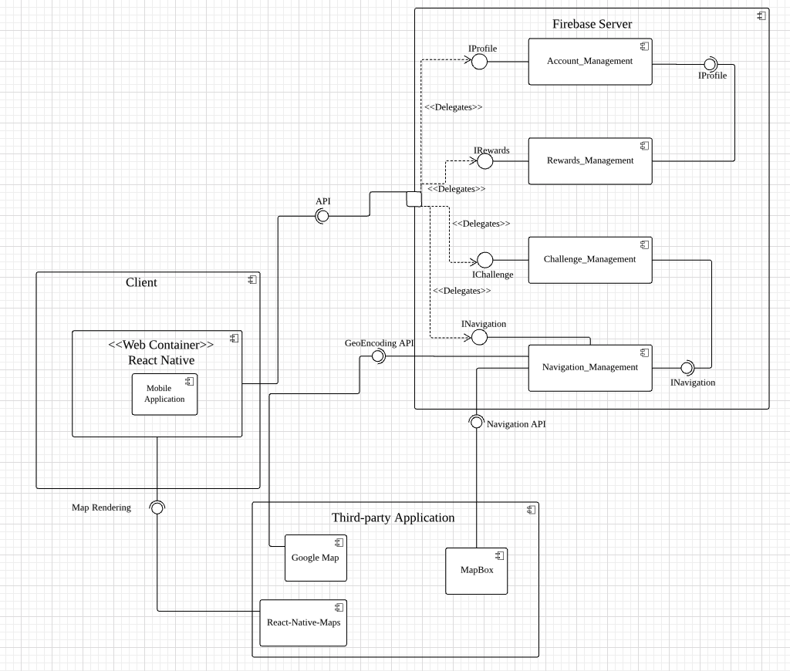

# Introduction
"FUNX" is an interactive navigation mobile application. The primary motivation behind the creation of “FUNX” is the resultant of a joint effort between LTA and SIT in trying to provide the general public with a more enjoyable FMLM journey whilst also promoting walking. One key feature behind our mobile application is that it capitalizes on the use of AR to bring fun and enjoyment whilst eliminating monotonicity to commuters as they frequent from one destination to the next. It adopts a point-based system where users can exchange the points earned for rewards as an incentive to walk more. Points are awarded to commuters upon successfully traveling from one location to another. Bonus points will also be awarded when users explore new routes, or successfully completes the challenges proposed to them. These challenges will provide an interesting twist leading to a more interactive and dynamic environment as compared to other navigation systems. The application also allows the community to provide feedback upon completion of their travels to warn or recommend the route to other users.

# Final Component Diagram

# How to run
1. Install EXPO application on IOS or Android
2. Open your terminal or windows equivalent 
3. cd to "project folder"/client
4. npm install (to install necessary node modules in package.json)
5. Once installed, expo start (to run the application)
6. Scan the QR code either on the terminal or the website. 
7. The application will be launched via EXPO. 

# FAQ
Question: Oh no my AR cannot start up.

Answer: Currently the AR version only works on IOS as the support for AR in android are still in development by EXPO team. 

Question: AppEntry.js error

Answer: 
1. Go to node_modules folder in client folder
2. Find expo folder not @expo
3. Open up AppEntry.js
4. Edit the path for the App.js which can be found inside the client folder

# Youtube URL
https://youtu.be/7itD1r2XmbU

# Feedback Form for our FUNX App - 
https://forms.gle/aKKYoBjhLmrkk4GP6

# APK URL
https://drive.google.com/open?id=1KaAMtdJScnSq4SLkRU7Xku0IhgW5Bmm3
